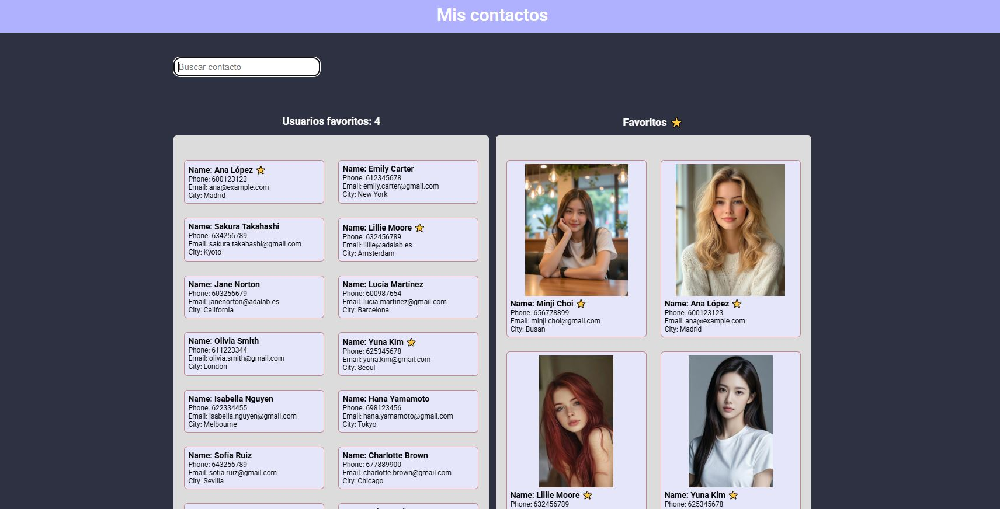

# 📒 Agenda de Contactos

Una aplicación web desarrollada con React que permite visualizar, buscar y marcar como favoritos distintos contactos. Pensada para ofrecer una interfaz limpia, funcional y personalizable.

## 🚀 Características

- Visualización de una lista completa de contactos.
- Búsqueda en tiempo real por nombre o apellido.
- Posibilidad de marcar contactos como **favoritos**.
- Visualización separada de contactos favoritos, con ⭐ e imagen personalizada.
- Persistencia de favoritos usando `localStorage` (los datos no se pierden al recargar o cerrar el navegador).

## 🧠 Tecnologías utilizadas

- **React** — Biblioteca principal para la interfaz de usuario.
- **Vite** — Bundler rápido para desarrollo moderno.
- **SCSS** + **TailwindCSS (opcional)** — Para el estilado de componentes.
- **localStorage** — Para persistencia en el frontend.
- **ESLint** — Para asegurar calidad de código.
- **JSON** — Fuente de datos simulada.

## 📁 Estructura de carpetas destacada

src/
│
├── components/
│ ├── App.jsx # Componente principal
│ ├── InputSearch.jsx # Input para filtrar contactos
│ └── contacts/
│ ├── UserList.jsx # Lista de contactos
│ └── UserItem.jsx # Contacto individual
│
├── data/
│ └── contacts.json # Datos base de contactos
│
├── styles/
│ ├── App.scss # Estilos globales
│ └── core/\_reset.scss # Reset base

## 🖼️ Imágenes de contacto

Las imágenes de los contactos están ubicadas en: public/images/

El campo `"image"` en `contacts.json` debe coincidir con el nombre del archivo. Ejemplo:

```json
{
  "name": "Olivia",
  "image": "olivia_smith.jpg"
}
```

🧪 ¿Cómo usar este proyecto?

1. Clona el repositorio:

```bash
git clone https://github.com/tu_usuario/agenda-de-contactos.git
cd agenda-de-contactos
```

2. Instala dependencias:

```bash
npm install
```

3. Ejecuta el entorno de desarrollo:

```bash
npm run dev
```

4. Abre http://localhost:5173 en tu navegador.

## 🖼️ Capturas de pantalla



✅ Pendientes o mejoras futuras

- Soporte para edición y eliminación de contactos.

- Subida de imágenes desde el navegador.

- Conexión a backend para persistencia real.

- Soporte multilenguaje.

👩‍💻 Autora
Desarrollado por Cristina Pérez.
